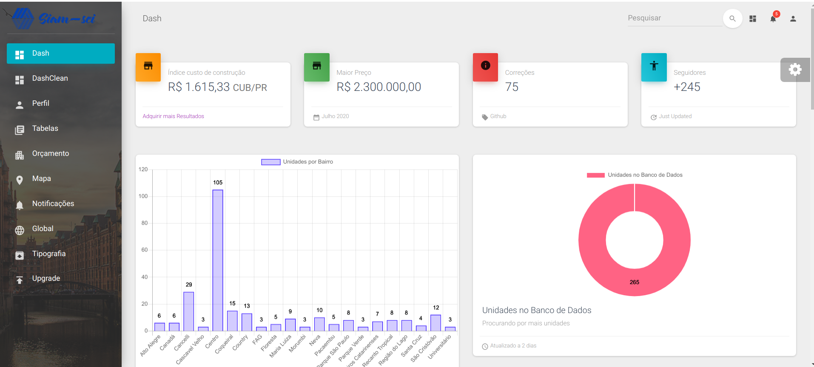
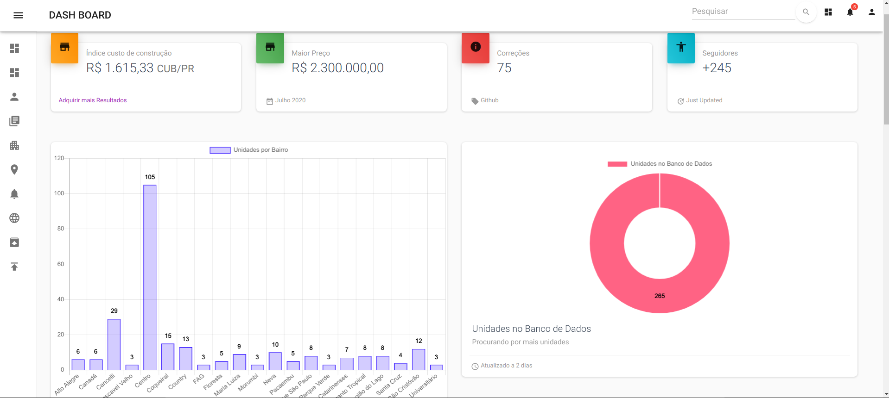
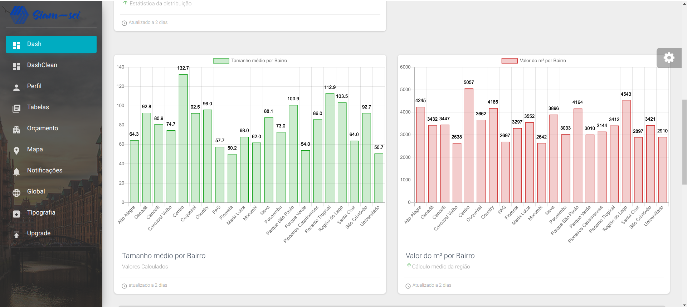
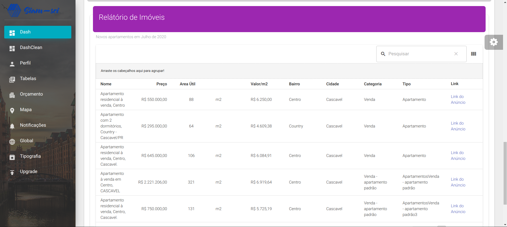

<h1>Projeto SIAM-SCI</h1>
 Web scraping –inteligência artificial –Machine Learning –Sciencedata

 Projeto voltado para coleta e ciência de dados do setor imobiliário. 
 Fornece uma dashboard com métricas de imóveis a venda em uma determinada cidade.
 Utiliza-se de web-scrapping com tratamento dos dados coletados para produção dos relatórios.

<a href="/assets/ResultadoCascavelJulho.pdf" target="__blanc">Relatório exemplo</a>
## 🚀 Tecnologias

Esse projeto foi desenvolvido com as seguintes tecnologias:

- [React]
- [NodeJs]
- [MongoDb]

## 💻 Projeto

  <h4>Features:</h4>
  <ul>
    <li>Dashboard de apresentação dos resultados</li>
    <li>Gráfico que apresentada quantidade de imóveis capturados</li>
    <li>Gráfico que apresentada distribuição de imóveis capturados por bairro</li>
    <li>Gráfico que apresentada valor médio do m2 - distribuidos por bairro</li>
    <li>Gráfico que apresentada tamanho médio em m2 das únidades distribuidos por bairro</li>
    <li>Tabelas demonstrativas com todos os resultados cálculados</li>
    <li>Total de itens no carrinho</li>
    <li>Total dos produtos no carrinho</li>
  </ul>

## 🔖 Layout

<table>
  <tr>
    <td><strong>Dashboard</strong></td>
    <td><strong>Opção de escolha para Dashboard</strong></td>
  <tr>
   <tr>
    <td></td>
    <td></td>
  <tr>
</table>

<table>
  <tr>
    <td><strong>Gráficos</strong></td>
    <td><strong>Tableas</strong></td>
    <td><strong>Página de Perfil</strong></td>
  <tr>
   <tr>
    <td></td>
    <td></td>
    <td></td>
  <tr>
</table>

## Licença

Esse projeto está sob a licença MIT.

Execute yarn install ou npm install para instalação.

